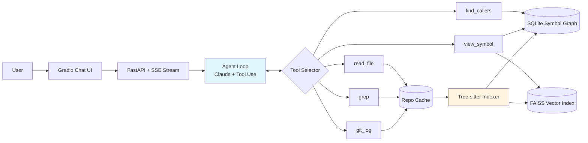

# Codebase Explainer Agent

> Point it at any GitHub repo. Ask engineering questions. Get answers grounded in the actual source code.

[](https://github.com/Kasho323/codebase-explainer-agent/actions/workflows/ci.yml)
[](LICENSE)
[](https://www.python.org/downloads/)

⚠️ **Status: under active development — first public milestone targeted for mid-June 2026.** This README documents the design; not all components are implemented yet. See [Roadmap](#roadmap).

---

## Why

When joining a new codebase — whether onboarding to a new job, contributing to open source, or auditing a dependency — most of the work is *navigation*: figuring out what calls what, why a module exists, and where to make a change. LLM chat alone is not enough: it hallucinates without grounding. Naive RAG is not enough: it retrieves text but loses the call graph.

This project combines a **tree-sitter symbol graph** with **embedding-based retrieval** and lets a Claude agent navigate both via tool use, citing specific `file:line` for every claim.

---

## What it does

**Input**: a public GitHub repository URL.

**Output**: an interactive chat that can answer questions like:
- *"Who calls the `authenticate` function?"*
- *"What's the design intent behind the `Storage` abstraction?"*
- *"If I wanted to add OAuth support, which files would I need to touch?"*
- *"Walk me through what happens when a request hits `/api/users`."*

Every answer cites concrete `file:line` references that you can click to verify.

---

## Architecture



**Three-layer retrieval**:
1. **Symbol layer** — tree-sitter extracts every function, class, import, and call edge into a SQLite graph. Exact lookups: "find callers of X", "list methods of class Y".
2. **Embedding layer** — file-level chunks + symbol-doc chunks embedded with `sentence-transformers/all-MiniLM-L6-v2`, indexed in FAISS. Fuzzy lookups: "find anything related to authentication".
3. **Agent layer** — Claude Sonnet 4.6 with five tools, decides which layer to query based on the question. Uses extended thinking for multi-step navigation, prompt caching for the symbol summary that's repeated across turns.

---

## Tech stack

| Layer | Choice | Why |
|---|---|---|
| LLM | Anthropic Claude Sonnet 4.6 | Cheapest model with strong tool use and 200K context. Opus 4.7 reserved for top-of-funnel routing. |
| Code parsing | tree-sitter (Python, JavaScript, Go) | Battle-tested AST extraction, language-agnostic |
| Symbol store | SQLite | Zero infra, fast joins for call-graph queries |
| Vector store | FAISS (local) | No external service, fits in RAM for repos under 100k LOC |
| Embeddings | `sentence-transformers/all-MiniLM-L6-v2` | Free, runs on CPU, 384-dim |
| Web | FastAPI + SSE | Streaming token output, simple async |
| UI | Gradio | One-file chat UI, deploys to HF Spaces |
| Deploy | Hugging Face Spaces (free tier) | Zero-cost hosting for demo |

---

## Quick start (once implemented)

```bash
# Clone and install
git clone https://github.com/Kasho323/codebase-explainer-agent
cd codebase-explainer-agent
pip install -r requirements.txt

# Set your Anthropic API key
export ANTHROPIC_API_KEY=sk-ant-...

# Index a repo
python -m codebase_explainer index https://github.com/encode/httpx

# Start the chat server
python -m codebase_explainer serve

# Open http://localhost:8000
```

---

## Evaluation

Quality is tracked against a frozen eval set: **5 real open-source repos × 4 question types = 20 golden cases**. See [`eval/golden_cases/`](eval/golden_cases/).

Each case has:
- A question
- An expected file:line citation that any correct answer must include
- A free-form "expected gist" judged by Claude as LLM judge

Metrics tracked per release:
- **Citation accuracy**: did the answer cite the expected file:line?
- **Answer faithfulness**: does the answer use only retrieved content (LLM judge)?
- **End-to-end latency p50 / p95**
- **Token cost per query** (separated into input / cached / output)

Run: `pytest eval/ -v --report=eval-report.html`

---

## Roadmap

**6 weeks, May 5 → June 15, 2026**

- [x] **Week 1** (4/28–5/4) — Repo scaffolding, README, CI, FastAPI hello-world endpoint
- [x] **Week 2** (5/5–5/11) — Tree-sitter Python indexer; SQLite schema for symbols/imports/calls; `python -m codebase_explainer index <path>` walks a real repo, persists into SQLite, and runs a callee-resolution pass that fills `calls.callee_id` for in-repo references via self/cls scoping, import aliases, and same-file lookup
- [ ] **Week 3** (5/12–5/18) — Agent loop with three tools (`read_file`, `grep`, `find_callers`); CLI chat working end-to-end
- [ ] **Week 4** (5/19–5/25) — Embedding layer (FAISS + sentence-transformers); add JavaScript and Go grammars; `view_symbol` tool
- [ ] **Week 5** (5/26–6/1) — Eval harness with 20 golden cases; `git_log` tool; prompt caching wired in
- [ ] **Week 6** (6/2–6/15) — Gradio UI; HF Spaces deploy; demo gif; polish README; companion blog post

---

## Project layout

```
codebase-explainer-agent/
├── src/codebase_explainer/
│   ├── __init__.py
│   ├── main.py             # FastAPI app entry
│   ├── agent.py            # Claude agent loop with tool use
│   ├── tools.py            # Tool implementations (read_file, grep, etc.)
│   ├── indexer.py          # Tree-sitter → SQLite symbol graph
│   ├── retriever.py        # FAISS embedding retrieval
│   └── repo_cache.py       # Clone + cache management
├── tests/                  # pytest suite
├── eval/golden_cases/      # Frozen eval set
├── .github/workflows/ci.yml
└── pyproject.toml
```

---

## License

MIT — see [LICENSE](LICENSE).
