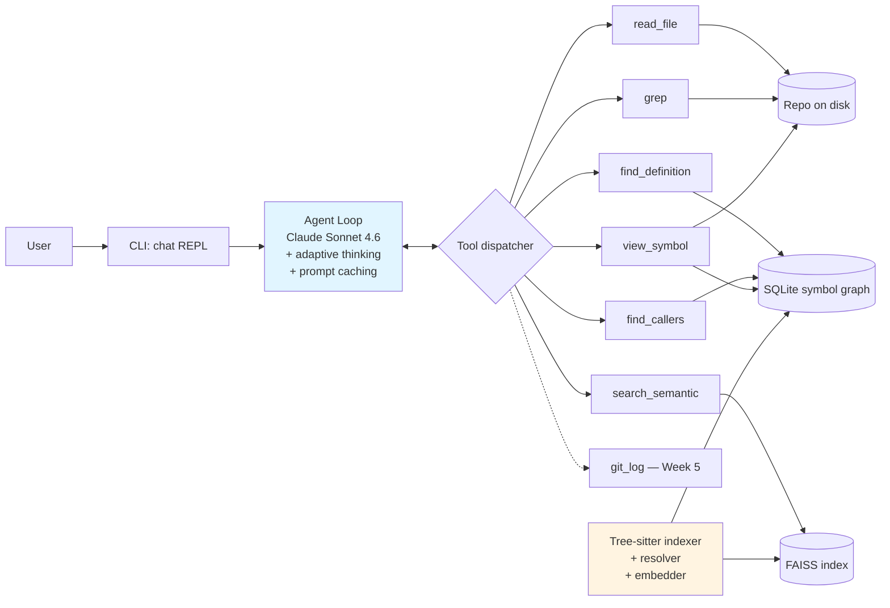

# Codebase Explainer Agent

> Point it at any Python repo. Ask engineering questions. Get answers grounded in the actual source code.

[](https://github.com/Kasho323/codebase-explainer-agent/actions/workflows/ci.yml)
[](LICENSE)
[](https://www.python.org/downloads/)

⚠️ **Status: under active development — first public milestone targeted for mid-June 2026.** Indexer, CLI chat, and the embedding-backed semantic search tool are working today; multi-language grammars, eval harness, and Gradio UI ship in weeks 4–6. See [Roadmap](#roadmap).

---

## Why

When joining a new codebase — onboarding to a new job, contributing to open source, auditing a dependency — most of the work is *navigation*: figuring out what calls what, why a module exists, and where to make a change. LLM chat alone is not enough: it hallucinates without grounding. Naive RAG is not enough: it retrieves text but loses the call graph.

This project combines a **tree-sitter symbol graph** in SQLite with a **Claude agent that navigates it via tool use**, citing specific `path:line` for every claim.

---

## What it does

**Input**: a Python repo on disk.

**Output**: an interactive chat that can answer questions like:
- *"Who calls the `authenticate` function?"*
- *"What's the design intent behind the `Storage` abstraction?"*
- *"If I wanted to add OAuth support, which files would I need to touch?"*
- *"Walk me through what happens when a request hits `/api/users`."*

Every answer cites concrete `path:line` references that you can click to verify.

---

## Architecture



**How it answers**:
1. **Symbol layer** — tree-sitter extracts every function, class, method, import, and call edge into a SQLite graph. A resolution pass turns textual callees (`basket.build_graph`) into `symbols.id` foreign keys via import-aware lookup, so "who calls X" becomes a JOIN, not a regex.
2. **Embedding layer** — every symbol's signature + docstring + body is embedded with `sentence-transformers/all-MiniLM-L6-v2` (384-dim, CPU) and stored as a BLOB in SQLite. Search builds an in-memory FAISS index per query — fast for repos under ~10K symbols, no separate index file to keep in sync. Enabled with `index --embed`; the `search_semantic` tool is automatically dropped from the agent's tool list when the index has no embeddings, so Claude doesn't waste a call discovering it's unavailable.
3. **Agent layer** — Claude Sonnet 4.6 with six tools (`read_file`, `grep`, `find_definition`, `find_callers`, `view_symbol`, `search_semantic`) decides which layer to query. Adaptive thinking for multi-step navigation, prompt caching for the tool list and system prompt. One more tool (`git_log`) ships in Week 5.

---

## Tech stack

| Layer | Choice | Why |
|---|---|---|
| LLM | Anthropic Claude Sonnet 4.6 | Strong tool use, 200K context, balanced cost. Adaptive thinking + `effort=medium` by default. |
| Code parsing | tree-sitter (Python today; JavaScript + Go upcoming) | Battle-tested AST extraction, language-agnostic. |
| Symbol store | SQLite | Zero infra, fast joins for call-graph queries, fits in a single file you can `scp` around. |
| Vector store | FAISS (local, in-memory `IndexFlatIP`) | No external service, no second file to keep in sync. Fits in RAM for repos under 100k LOC. |
| Embeddings | `sentence-transformers/all-MiniLM-L6-v2` | Free, CPU-only, 384-dim. Vectors stored as float32 BLOBs in SQLite. |
| UI | CLI today; Gradio + HF Spaces in Week 6 | One-file chat UI, zero-cost public demo. |

---

## Quick start

```bash
git clone https://github.com/Kasho323/codebase-explainer-agent
cd codebase-explainer-agent
pip install -r requirements.txt

# 1. Index a Python repo on disk. The DB is a single SQLite file.
#    Add --embed to also embed every symbol for the semantic search tool
#    (first run downloads ~80MB of model weights).
python -m codebase_explainer index /path/to/some/repo --db /tmp/idx.sqlite3 [--embed]

# 2. Point chat at the indexed DB and the repo root.
export ANTHROPIC_API_KEY=sk-ant-...           # Linux/macOS
# $env:ANTHROPIC_API_KEY = "sk-ant-..."       # Windows PowerShell
python -m codebase_explainer chat \
    --db /tmp/idx.sqlite3 \
    --repo-root /path/to/some/repo
```

The chat REPL opens with a banner showing the index size, then accepts free-form questions. As the agent works, every tool call prints to the screen so you can see exactly what's being read:

```
You> who calls build_graph in this repo?

  -> find_callers(name='build_graph')
  -> read_file(path='basket_graph/main.py', start_line=60, end_line=70)

[agent's grounded answer with path:line citations]

You> /exit
```

Commands inside the REPL: `/exit`, `/reset` (clear conversation), `/help`.

### Try it on a small target

The smaller [`Kasho323/basket-graph-analytics`](https://github.com/Kasho323/basket-graph-analytics) repo (~500 LOC, classic graph-mining problem) is a quick way to see the agent in action without indexing something huge:

```bash
git clone https://github.com/Kasho323/basket-graph-analytics
python -m codebase_explainer index ./basket-graph-analytics --db /tmp/basket.sqlite3
python -m codebase_explainer chat --db /tmp/basket.sqlite3 --repo-root ./basket-graph-analytics
```

Good first questions to try:
- *"Who calls build_graph and what does it return?"*
- *"Explain what dfs._visit does and where it's defined."*
- *"Why does benchmark.py exist? What is it measuring?"*

### Local web demo

Same agent, in a browser. Requires an API key.

```bash
pip install -r requirements.txt
python -m codebase_explainer index ./some-repo --db /tmp/x.sqlite3

# Anthropic (default)
ANTHROPIC_API_KEY=sk-ant-... \
    python -m codebase_explainer demo --db /tmp/x.sqlite3 --repo-root ./some-repo

# Open http://localhost:7860
```

DeepSeek's Anthropic-compatible endpoint also works — set
`ANTHROPIC_BASE_URL=https://api.deepseek.com/anthropic`, plus
`ANTHROPIC_AUTH_TOKEN` (or `ANTHROPIC_API_KEY`) and `ANTHROPIC_MODEL`.

---

## Evaluation (Week 5 — planned)

*Coming Week 5:* Quality is tracked against a frozen eval set: **5 real open-source repos × 4 question types = 20 golden cases**. See [`eval/golden_cases/`](eval/golden_cases/).

Each case has a question, an expected `file:line` citation that any correct answer must include, and a free-form "expected gist" judged by Claude as LLM judge. Metrics tracked per release: citation accuracy, answer faithfulness, end-to-end latency p50/p95, token cost per query (split into input / cached / output).

---

## Roadmap

**6 weeks, May 5 → June 15, 2026**

- [x] **Week 1** (4/28–5/4) — Repo scaffolding, README, CI, FastAPI hello-world endpoint.
- [x] **Week 2** (5/5–5/11) — Tree-sitter Python indexer; SQLite schema for symbols/imports/calls; `python -m codebase_explainer index <path>` walks a real repo, persists into SQLite, and runs a callee-resolution pass that fills `calls.callee_id` for in-repo references via self/cls scoping, import aliases, and same-file lookup.
- [x] **Week 3** (5/12–5/18) — Manual tool-use loop on Claude Sonnet 4.6 with four tools (`read_file`, `grep`, `find_definition`, `find_callers`). Adaptive thinking + prompt caching wired in. Interactive REPL via `python -m codebase_explainer chat --db <file> --repo-root <path>` with `/reset` / `/exit`, surfaces every tool call as the agent makes it, cites results as `path:line`. **115 tests passing.**
- [ ] **Week 4** (5/19–5/25) — partially shipped:
  - [x] `view_symbol` tool: one-shot deep lookup returning location, signature, docstring, source body, parent, callers, and callees.
  - [x] Embedding layer: every symbol embedded with `sentence-transformers/all-MiniLM-L6-v2`, vectors stored as float32 BLOBs in SQLite, FAISS `IndexFlatIP` built in-memory per query. New `search_semantic` tool wired into the agent. The tool is auto-dropped from the active tool list if no embeddings exist, so prompt-cache stays stable across sessions. **115 tests passing.**
  - [ ] JavaScript and Go grammars (Go may slip to Week 5 depending on indexer dispatch refactor).
- [ ] **Week 5** (5/26–6/1) — Eval harness with 20 golden cases; `git_log` tool; deeper prompt-caching tuning across long sessions.
- [ ] **Week 6** (6/2–6/15) — Gradio UI; Hugging Face Spaces deploy; demo gif; polish README; companion blog post.

---

## Project layout

```
codebase-explainer-agent/
├── src/codebase_explainer/
│   ├── __init__.py
│   ├── __main__.py          # CLI: python -m codebase_explainer {index,chat}
│   ├── agent.py             # Manual tool-use loop with prompt caching
│   ├── chat.py              # Interactive REPL with /reset and /exit
│   ├── tools/
│   │   ├── __init__.py      # TOOL_HANDLERS registry + EMBEDDING_DEPENDENT_TOOLS
│   │   ├── definitions.py   # Tool JSON schemas (byte-stable for caching)
│   │   ├── read_file.py
│   │   ├── grep.py
│   │   ├── find_definition.py
│   │   ├── find_callers.py
│   │   ├── view_symbol.py
│   │   └── search_semantic.py
│   ├── embeddings/
│   │   ├── __init__.py
│   │   ├── embedder.py      # Embedder protocol + Fake + SentenceTransformer impls
│   │   ├── chunker.py       # Symbol → embeddable text
│   │   └── store.py         # SQLite BLOBs + in-memory FAISS search
│   ├── indexer.py           # Tree-sitter → Symbol / Call / Import dataclasses
│   ├── repo_walker.py       # File-tree walker with VCS/cache skip-list
│   ├── persistence.py       # Idempotent FileIndex → SQLite
│   ├── resolver.py          # Resolve textual callees → symbol_id
│   ├── index_repo.py        # Orchestrator: walk + parse + persist + resolve + (optional) embed
│   └── schema.py            # SQLite DDL (v3: + embeddings table)
├── tests/                   # 115 tests across 12 files
├── eval/golden_cases/       # Frozen eval set (Week 5)
├── .github/workflows/ci.yml
└── pyproject.toml
```

---

## License

MIT — see [LICENSE](LICENSE).
